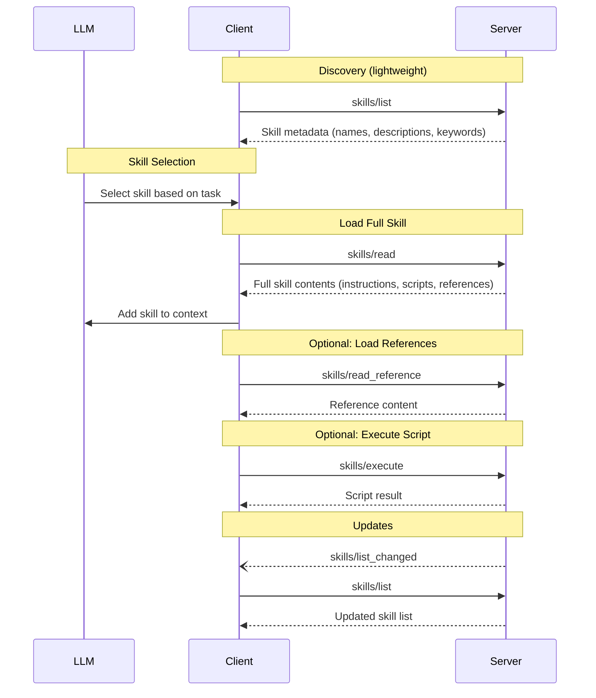

<div id="enable-section-numbers" />

<Info>**Protocol Revision**: draft</Info>

The Model Context Protocol (MCP) allows servers to expose skills that can be discovered and loaded by language models. Skills provide structured instructions, workflows, and domain expertise that help models perform tasks more accurately and efficiently. Each skill is uniquely identified by a name and includes metadata describing its purpose and contents. Skills support **progressive disclosure**—clients load minimal metadata upfront, full instructions when relevant, and additional resources only when required.

## User Interaction Model

Skills in MCP are designed to be **model-controlled**, meaning that the language model can discover and load skills automatically based on its contextual understanding of the task at hand.

The protocol defines how skills are discovered and read. Clients are responsible for:

* Injecting skill metadata into the model's context at startup
* Determining when to activate skills based on user tasks
* Loading full skill contents when activated
* Executing scripts with appropriate sandboxing

However, implementations are free to expose skills through any interface pattern that suits their needs—the protocol itself does not mandate any specific user interaction model.

<Warning>
  Skills may contain executable scripts. Applications **SHOULD**:

  * Provide UI that makes clear which skills are available to the AI model
  * Insert clear visual indicators when skills are loaded into context
  * Present confirmation prompts before executing skill scripts
</Warning>

## Capabilities

Servers that support skills **MUST** declare the `skills` capability:

<Note>
  The protocol does not specify where servers should store or discover skills. Servers may load skills from local directories, remote registries, databases, or any other source. Clients interact with skills through the protocol methods regardless of underlying storage.
</Note>

```json
{
  "capabilities": {
    "skills": {
      "listChanged": true,
      "scripts": true
    }
  }
}
```

* `listChanged`: indicates whether the server will emit notifications when the list of available skills changes.
* `scripts`: indicates whether the server's skills include executable scripts.

## Protocol Messages

### Listing Skills

To discover available skills, clients send a `skills/list` request. This operation supports [pagination](/specification/draft/server/utilities/pagination).

This returns **metadata only**—not full skill contents. This enables progressive disclosure and keeps initial context load minimal.

**Request:**

```json
{
  "jsonrpc": "2.0",
  "id": 1,
  "method": "skills/list",
  "params": {
    "cursor": "optional-cursor-value"
  }
}
```

**Response:**

```json
{
  "jsonrpc": "2.0",
  "id": 1,
  "result": {
    "skills": [
      {
        "name": "create-presentation",
        "description": "Create professional PowerPoint presentations with proper formatting and structure. Use when the user asks to make slides, a slideshow, or a PPTX file."
      },
      {
        "name": "supabase-database",
        "description": "Best practices for Supabase database design, RLS policies, and Edge Functions. Use when working with Supabase, Postgres databases, or row-level security."
      }
    ],
    "nextCursor": "next-page-cursor"
  }
}
```

<Note>
  The `description` field should describe both what the skill does AND when to use it.
  This helps models determine when to activate the skill. Keep descriptions under 1024 characters.
</Note>

### Context Injection

Clients **SHOULD** inject skill metadata into the model's system prompt at startup so the model knows what skills are available.

Recommended format (for Claude models):

```xml
<available_skills>
  <skill>
    <name>pdf-processing</name>
    <description>Extracts text and tables from PDF files, fills forms, merges documents. Use when working with PDF documents.</description>
  </skill>
  <skill>
    <name>data-analysis</name>
    <description>Analyzes datasets, generates charts, and creates summary reports. Use when the user needs data analysis.</description>
  </skill>
</available_skills>
```

Each skill should add roughly 50-100 tokens to the context. Keep the total metadata footprint minimal to leave room for activated skill instructions.

For filesystem-based agents, include a `location` field with the path to the SKILL.md file:

```xml
<skill>
  <name>pdf-processing</name>
  <description>Extracts text and tables from PDF files...</description>
  <location>/mnt/skills/pdf-processing/SKILL.md</location>
</skill>
```

For MCP-based agents, the location can be omitted since the client will use `skills/read` to fetch the full skill.

### Reading Skills

To retrieve full skill contents, clients send a `skills/read` request:

**Request:**

```json
{
  "jsonrpc": "2.0",
  "id": 2,
  "method": "skills/read",
  "params": {
    "name": "create-presentation"
  }
}
```

**Response:**

```json
{
  "jsonrpc": "2.0",
  "id": 2,
  "result": {
    "skill": {
      "name": "create-presentation",
      "description": "Create professional PowerPoint presentations with proper formatting and structure.",
      "instructions": "# Presentation Creator\n\nThis skill helps you create professional PowerPoint presentations.\n\n## When to use\n\nActivate this skill when the user asks to:\n- Create a presentation or slideshow\n- Make a PowerPoint or PPTX file\n- Build slides for a talk or meeting\n\n## Workflow\n\n1. Gather requirements (topic, audience, length)\n2. Create outline structure\n3. Generate slide content\n4. Apply formatting using the provided scripts\n\n## Best Practices\n\n- Limit text to 6 bullets per slide\n- Use consistent heading hierarchy\n- Include speaker notes for complex slides\n\n## Available Scripts\n\nRun `scripts/create_pptx.py` to generate the final PPTX file.",
      "scripts": [
        {
          "name": "create_pptx.py",
          "description": "Create a new PowerPoint file with specified slides",
          "path": "scripts/create_pptx.py"
        }
      ],
      "references": [
        {
          "name": "templates.md",
          "description": "Available slide layout templates",
          "path": "references/templates.md"
        }
      ],
      "metadata": {
        "author": "example-org",
        "version": "1.0",
        "license": "Apache-2.0"
      }
    }
  }
}
```

The `instructions` field contains the full Markdown body of the SKILL.md file. This is what gets loaded into the model's context when the skill is activated.

### Reading Skill References

To retrieve additional reference materials for a skill, clients send a `skills/read_reference` request:

**Request:**

```json
{
  "jsonrpc": "2.0",
  "id": 3,
  "method": "skills/read_reference",
  "params": {
    "name": "create-presentation",
    "reference": "slide-templates"
  }
}
```

**Response:**

```json
{
  "jsonrpc": "2.0",
  "id": 3,
  "result": {
    "content": {
      "uri": "skill://create-presentation/references/templates.md",
      "mimeType": "text/markdown",
      "text": "# Slide Templates\n\n## Title Slide\n- Main title (44pt)\n- Subtitle (24pt)\n- Author/date footer\n\n## Content Slide\n- Heading (32pt)\n- Body text (18pt)\n- Up to 6 bullet points\n\n..."
    }
  }
}
```

### Executing Skill Scripts

To execute a script provided by a skill, clients send a `skills/execute` request:

**Request:**

```json
{
  "jsonrpc": "2.0",
  "id": 4,
  "method": "skills/execute",
  "params": {
    "name": "create-presentation",
    "script": "create_pptx",
    "arguments": {
      "title": "Q4 Sales Review",
      "slides": [
        {"type": "title", "title": "Q4 Sales Review", "subtitle": "January 2026"},
        {"type": "content", "heading": "Key Metrics", "bullets": ["Revenue: $4.2M", "Growth: 23%"]}
      ]
    }
  }
}
```

**Response:**

```json
{
  "jsonrpc": "2.0",
  "id": 4,
  "result": {
    "content": [
      {
        "type": "resource",
        "resource": {
          "uri": "file:///output/q4-sales-review.pptx",
          "mimeType": "application/vnd.openxmlformats-officedocument.presentationml.presentation",
          "name": "q4-sales-review.pptx"
        }
      }
    ],
    "isError": false
  }
}
```

### List Changed Notification

When the list of available skills changes, servers that declared the `listChanged` capability **SHOULD** send a notification:

```json
{
  "jsonrpc": "2.0",
  "method": "notifications/skills/list_changed"
}
```

## Message Flow



## Data Types

### Skill Metadata

Returned by `skills/list`. Lightweight metadata for progressive disclosure:

| Field | Required | Description |
|-------|----------|-------------|
| `name` | Yes | Unique identifier. Max 64 chars. Lowercase letters, numbers, hyphens only. |
| `description` | Yes | What the skill does and when to use it. Max 1024 chars. |

### Skill (Full)

Returned by `skills/read`. Complete skill definition:

| Field | Required | Description |
|-------|----------|-------------|
| `name` | Yes | Unique identifier (same as metadata) |
| `description` | Yes | What the skill does and when to use it |
| `instructions` | Yes | Full Markdown content (the SKILL.md body) |
| `scripts` | No | Array of executable script definitions |
| `references` | No | Array of reference file definitions |
| `assets` | No | Array of static asset definitions |
| `metadata` | No | Arbitrary key-value pairs (author, version, license, etc.) |

### Script Definition

| Field | Required | Description |
|-------|----------|-------------|
| `name` | Yes | Filename of the script |
| `description` | Yes | What the script does |
| `path` | Yes | Relative path from skill root (e.g., `scripts/extract.py`) |

### Reference Definition

| Field | Required | Description |
|-------|----------|-------------|
| `name` | Yes | Filename of the reference |
| `description` | Yes | What the reference contains |
| `path` | Yes | Relative path from skill root (e.g., `references/guide.md`) |

### Annotations

Skills and their contents support optional annotations:

* **`audience`**: Array indicating intended audience (`"user"`, `"assistant"`, or both)
* **`priority`**: Number from 0.0 to 1.0 indicating importance for context inclusion
* **`lastModified`**: ISO 8601 timestamp of last modification

Example skill with annotations:

```json
{
  "name": "supabase-database",
  "title": "Supabase Database Expert",
  "description": "Best practices for Supabase",
  "keywords": ["database", "supabase"],
  "annotations": {
    "audience": ["assistant"],
    "priority": 0.9,
    "lastModified": "2026-01-15T10:30:00Z"
  }
}
```

## Skill Activation

Skill activation follows the same model-controlled pattern as tools. The model sees available skill metadata in context and decides when to load full instructions based on the task at hand.

## File Paths

Scripts and references use relative paths from the skill root:

```
scripts/create_pptx.py
references/templates.md
assets/logo.png
```

Keep file references one level deep from the skill root. Avoid deeply nested reference chains.

## Error Handling

Servers **SHOULD** return standard JSON-RPC errors for common failure cases:

* Skill not found: `-32002`
* Script execution failed: `-32003`
* Reference not found: `-32004`
* Internal errors: `-32603`

Example error:

```json
{
  "jsonrpc": "2.0",
  "id": 5,
  "error": {
    "code": -32002,
    "message": "Skill not found",
    "data": {
      "name": "nonexistent-skill"
    }
  }
}
```

## Security Considerations

1. Servers **MUST**:
   * Validate all skill names and reference paths
   * Implement proper access controls for skill content
   * Sandbox script execution environments
   * Sanitize script outputs

2. Clients **SHOULD**:
   * Prompt for user confirmation before executing scripts
   * Display which skills are loaded into context
   * Implement timeouts for script execution
   * Log skill usage for audit purposes
   * Validate skill content before adding to model context

3. Script Security:
   * Scripts **SHOULD** be executed in isolated environments
   * Scripts **MUST NOT** have access to credentials unless explicitly granted
   * Servers **SHOULD** implement resource limits (CPU, memory, time) for script execution

## Relationship to Other Primitives

Skills complement MCP's other primitives:

| Primitive | Purpose | Model Interaction |
|-----------|---------|-------------------|
| **Tools** | Execute discrete actions | Model calls directly |
| **Resources** | Provide data/context | Application-driven |
| **Prompts** | User-triggered templates | User-initiated |
| **Skills** | Structured instructions + workflows | Model-controlled, progressive |

Skills may reference or depend on Tools:
* A skill's instructions might explain when/how to use specific tools
* A skill's scripts are essentially bundled tool implementations

Skills differ from Prompts:
* Prompts are user-triggered message templates
* Skills are model-pulled instruction sets loaded on demand

## Why Skills Over MCP?

Skills can also be loaded directly from the filesystem (see [Agent Skills](https://agentskills.io)). MCP provides additional capabilities:

| Capability | Filesystem | MCP |
|------------|------------|-----|
| Local skills | ✅ Direct file read | ✅ Local MCP server |
| Remote/shared skills | ❌ Requires custom solution | ✅ Native support |
| Discovery across sources | ❌ Scan known directories | ✅ Query any connected server |
| Authentication | ❌ OS-level only | ✅ Protocol-level auth |
| Skill registries | ❌ Manual distribution | ✅ Centralized servers |
| Cross-environment portability | ❌ Path/OS dependent | ✅ Protocol abstracts environment |
| Credential isolation | ❌ Agent has filesystem access | ✅ Server holds credentials |

For simple local development, filesystem-based skills may be sufficient. MCP becomes valuable when:

* Skills need to be shared across teams or organizations
* Skills require authentication or access control
* Agents operate in environments without direct filesystem access
* You want a unified protocol for tools, resources, and skills
